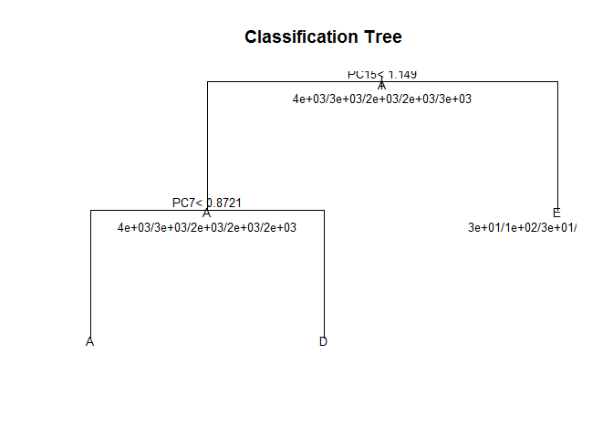

# Acitivty Prediction
Alex Chang  
Saturday, November 22, 2014  

The purpose of this report is to analyize data from accelerometers on the belt, forearm, arm, and dumbell of 6 participants to determine the manner of in which they did the excericse.


```r
myData <- read.csv("./data/training.csv")

# Loading librarys
library(caret);library(rpart);library(randomForest)
```

```
## Warning: package 'randomForest' was built under R version 3.1.2
```

```
## randomForest 4.6-10
## Type rfNews() to see new features/changes/bug fixes.
```


# Variable Selection
I start off by looking near zero variance covariates. And select the covariates
that are both not near zero and not NA.  


```r
nsv <- nearZeroVar(myData, saveMetrics=TRUE)
# exame the data
nsv
```

```
##                          freqRatio percentUnique zeroVar   nzv
## X                            1.000     100.00000   FALSE FALSE
## user_name                    1.101       0.03058   FALSE FALSE
## raw_timestamp_part_1         1.000       4.26562   FALSE FALSE
## raw_timestamp_part_2         1.000      85.53155   FALSE FALSE
## cvtd_timestamp               1.001       0.10193   FALSE FALSE
## new_window                  47.330       0.01019   FALSE  TRUE
## num_window                   1.000       4.37264   FALSE FALSE
## roll_belt                    1.102       6.77811   FALSE FALSE
## pitch_belt                   1.036       9.37723   FALSE FALSE
## yaw_belt                     1.058       9.97350   FALSE FALSE
## total_accel_belt             1.063       0.14779   FALSE FALSE
## kurtosis_roll_belt        1921.600       2.02324   FALSE  TRUE
## kurtosis_picth_belt        600.500       1.61553   FALSE  TRUE
## kurtosis_yaw_belt           47.330       0.01019   FALSE  TRUE
## skewness_roll_belt        2135.111       2.01305   FALSE  TRUE
## skewness_roll_belt.1       600.500       1.72256   FALSE  TRUE
## skewness_yaw_belt           47.330       0.01019   FALSE  TRUE
## max_roll_belt                1.000       0.99378   FALSE FALSE
## max_picth_belt               1.538       0.11212   FALSE FALSE
## max_yaw_belt               640.533       0.34655   FALSE  TRUE
## min_roll_belt                1.000       0.93772   FALSE FALSE
## min_pitch_belt               2.192       0.08154   FALSE FALSE
## min_yaw_belt               640.533       0.34655   FALSE  TRUE
## amplitude_roll_belt          1.290       0.75426   FALSE FALSE
## amplitude_pitch_belt         3.042       0.06625   FALSE FALSE
## amplitude_yaw_belt          50.042       0.02039   FALSE  TRUE
## var_total_accel_belt         1.427       0.33126   FALSE FALSE
## avg_roll_belt                1.067       0.97340   FALSE FALSE
## stddev_roll_belt             1.039       0.35165   FALSE FALSE
## var_roll_belt                1.615       0.48925   FALSE FALSE
## avg_pitch_belt               1.375       1.09061   FALSE FALSE
## stddev_pitch_belt            1.161       0.21914   FALSE FALSE
## var_pitch_belt               1.308       0.32107   FALSE FALSE
## avg_yaw_belt                 1.200       1.22312   FALSE FALSE
## stddev_yaw_belt              1.694       0.29559   FALSE FALSE
## var_yaw_belt                 1.500       0.73897   FALSE FALSE
## gyros_belt_x                 1.059       0.71348   FALSE FALSE
## gyros_belt_y                 1.144       0.35165   FALSE FALSE
## gyros_belt_z                 1.066       0.86128   FALSE FALSE
## accel_belt_x                 1.055       0.83580   FALSE FALSE
## accel_belt_y                 1.114       0.72877   FALSE FALSE
## accel_belt_z                 1.079       1.52380   FALSE FALSE
## magnet_belt_x                1.090       1.66650   FALSE FALSE
## magnet_belt_y                1.100       1.51870   FALSE FALSE
## magnet_belt_z                1.006       2.32902   FALSE FALSE
## roll_arm                    52.338      13.52563   FALSE FALSE
## pitch_arm                   87.256      15.73234   FALSE FALSE
## yaw_arm                     33.029      14.65702   FALSE FALSE
## total_accel_arm              1.025       0.33636   FALSE FALSE
## var_accel_arm                5.500       2.01305   FALSE FALSE
## avg_roll_arm                77.000       1.68179   FALSE  TRUE
## stddev_roll_arm             77.000       1.68179   FALSE  TRUE
## var_roll_arm                38.500       1.65630   FALSE  TRUE
## avg_pitch_arm               77.000       1.68179   FALSE  TRUE
## stddev_pitch_arm            77.000       1.68179   FALSE  TRUE
## var_pitch_arm               77.000       1.68179   FALSE  TRUE
## avg_yaw_arm                 77.000       1.68179   FALSE  TRUE
## stddev_yaw_arm              80.000       1.66650   FALSE  TRUE
## var_yaw_arm                 40.000       1.65121   FALSE  TRUE
## gyros_arm_x                  1.016       3.27693   FALSE FALSE
## gyros_arm_y                  1.454       1.91622   FALSE FALSE
## gyros_arm_z                  1.111       1.26389   FALSE FALSE
## accel_arm_x                  1.017       3.95984   FALSE FALSE
## accel_arm_y                  1.140       2.73672   FALSE FALSE
## accel_arm_z                  1.128       4.03629   FALSE FALSE
## magnet_arm_x                 1.000       6.82397   FALSE FALSE
## magnet_arm_y                 1.057       4.44399   FALSE FALSE
## magnet_arm_z                 1.036       6.44685   FALSE FALSE
## kurtosis_roll_arm          246.359       1.68179   FALSE  TRUE
## kurtosis_picth_arm         240.200       1.67159   FALSE  TRUE
## kurtosis_yaw_arm          1746.909       2.01305   FALSE  TRUE
## skewness_roll_arm          249.558       1.68688   FALSE  TRUE
## skewness_pitch_arm         240.200       1.67159   FALSE  TRUE
## skewness_yaw_arm          1746.909       2.01305   FALSE  TRUE
## max_roll_arm                25.667       1.47793   FALSE  TRUE
## max_picth_arm               12.833       1.34033   FALSE FALSE
## max_yaw_arm                  1.227       0.25991   FALSE FALSE
## min_roll_arm                19.250       1.41678   FALSE  TRUE
## min_pitch_arm               19.250       1.47793   FALSE  TRUE
## min_yaw_arm                  1.000       0.19366   FALSE FALSE
## amplitude_roll_arm          25.667       1.55947   FALSE  TRUE
## amplitude_pitch_arm         20.000       1.49832   FALSE  TRUE
## amplitude_yaw_arm            1.037       0.25991   FALSE FALSE
## roll_dumbbell                1.022      83.78351   FALSE FALSE
## pitch_dumbbell               2.277      81.22516   FALSE FALSE
## yaw_dumbbell                 1.132      83.14137   FALSE FALSE
## kurtosis_roll_dumbbell    3843.200       2.02834   FALSE  TRUE
## kurtosis_picth_dumbbell   9608.000       2.04362   FALSE  TRUE
## kurtosis_yaw_dumbbell       47.330       0.01019   FALSE  TRUE
## skewness_roll_dumbbell    4804.000       2.04362   FALSE  TRUE
## skewness_pitch_dumbbell   9608.000       2.04872   FALSE  TRUE
## skewness_yaw_dumbbell       47.330       0.01019   FALSE  TRUE
## max_roll_dumbbell            1.000       1.72256   FALSE FALSE
## max_picth_dumbbell           1.333       1.72765   FALSE FALSE
## max_yaw_dumbbell           960.800       0.37203   FALSE  TRUE
## min_roll_dumbbell            1.000       1.69198   FALSE FALSE
## min_pitch_dumbbell           1.667       1.81429   FALSE FALSE
## min_yaw_dumbbell           960.800       0.37203   FALSE  TRUE
## amplitude_roll_dumbbell      8.000       1.97228   FALSE FALSE
## amplitude_pitch_dumbbell     8.000       1.95189   FALSE FALSE
## amplitude_yaw_dumbbell      47.920       0.01529   FALSE  TRUE
## total_accel_dumbbell         1.073       0.21914   FALSE FALSE
## var_accel_dumbbell           6.000       1.95699   FALSE FALSE
## avg_roll_dumbbell            1.000       2.02324   FALSE FALSE
## stddev_roll_dumbbell        16.000       1.99266   FALSE FALSE
## var_roll_dumbbell            8.000       1.97228   FALSE FALSE
## avg_pitch_dumbbell           1.000       2.02324   FALSE FALSE
## stddev_pitch_dumbbell       16.000       1.99266   FALSE FALSE
## var_pitch_dumbbell          16.000       1.99266   FALSE FALSE
## avg_yaw_dumbbell             1.000       2.02324   FALSE FALSE
## stddev_yaw_dumbbell         16.000       1.99266   FALSE FALSE
## var_yaw_dumbbell             8.000       1.97228   FALSE FALSE
## gyros_dumbbell_x             1.003       1.22821   FALSE FALSE
## gyros_dumbbell_y             1.265       1.41678   FALSE FALSE
## gyros_dumbbell_z             1.060       1.04984   FALSE FALSE
## accel_dumbbell_x             1.018       2.16594   FALSE FALSE
## accel_dumbbell_y             1.053       2.37489   FALSE FALSE
## accel_dumbbell_z             1.133       2.08949   FALSE FALSE
## magnet_dumbbell_x            1.098       5.74865   FALSE FALSE
## magnet_dumbbell_y            1.198       4.30129   FALSE FALSE
## magnet_dumbbell_z            1.021       3.44511   FALSE FALSE
## roll_forearm                11.589      11.08959   FALSE FALSE
## pitch_forearm               65.983      14.85577   FALSE FALSE
## yaw_forearm                 15.323      10.14677   FALSE FALSE
## kurtosis_roll_forearm      228.762       1.64102   FALSE  TRUE
## kurtosis_picth_forearm     226.071       1.64611   FALSE  TRUE
## kurtosis_yaw_forearm        47.330       0.01019   FALSE  TRUE
## skewness_roll_forearm      231.518       1.64611   FALSE  TRUE
## skewness_pitch_forearm     226.071       1.62573   FALSE  TRUE
## skewness_yaw_forearm        47.330       0.01019   FALSE  TRUE
## max_roll_forearm            27.667       1.38110   FALSE  TRUE
## max_picth_forearm            2.964       0.78993   FALSE FALSE
## max_yaw_forearm            228.762       0.22933   FALSE  TRUE
## min_roll_forearm            27.667       1.37091   FALSE  TRUE
## min_pitch_forearm            2.862       0.87147   FALSE FALSE
## min_yaw_forearm            228.762       0.22933   FALSE  TRUE
## amplitude_roll_forearm      20.750       1.49322   FALSE  TRUE
## amplitude_pitch_forearm      3.269       0.93263   FALSE FALSE
## amplitude_yaw_forearm       59.677       0.01529   FALSE  TRUE
## total_accel_forearm          1.129       0.35674   FALSE FALSE
## var_accel_forearm            3.500       2.03343   FALSE FALSE
## avg_roll_forearm            27.667       1.64102   FALSE  TRUE
## stddev_roll_forearm         87.000       1.63082   FALSE  TRUE
## var_roll_forearm            43.500       1.60534   FALSE  TRUE
## avg_pitch_forearm           83.000       1.65121   FALSE  TRUE
## stddev_pitch_forearm        41.500       1.64611   FALSE  TRUE
## var_pitch_forearm           41.500       1.63592   FALSE  TRUE
## avg_yaw_forearm             83.000       1.65121   FALSE  TRUE
## stddev_yaw_forearm          85.000       1.64102   FALSE  TRUE
## var_yaw_forearm             42.500       1.63082   FALSE  TRUE
## gyros_forearm_x              1.059       1.51870   FALSE FALSE
## gyros_forearm_y              1.037       3.77637   FALSE FALSE
## gyros_forearm_z              1.123       1.56457   FALSE FALSE
## accel_forearm_x              1.126       4.04648   FALSE FALSE
## accel_forearm_y              1.059       5.11161   FALSE FALSE
## accel_forearm_z              1.006       2.95587   FALSE FALSE
## magnet_forearm_x             1.012       7.76679   FALSE FALSE
## magnet_forearm_y             1.247       9.54031   FALSE FALSE
## magnet_forearm_z             1.000       8.57711   FALSE FALSE
## classe                       1.470       0.02548   FALSE FALSE
```

```r
# Remove near zero variances
myData <- myData[,c(nsv$nzv==FALSE)]
# Remove variances that has NA
myData <- myData[,(colSums(is.na(myData))==0)]
# Remove covariaates X as it is completely unique and factor variables except classe (this is the predictor)
myData <- myData[,7:ncol(myData)]
```

This results in `ncol(myData)-1` of variables. 

# Split data into test set and validation set

```r
inTrain <- createDataPartition(y=myData$classe,p=0.7,list=FALSE)
training <- myData[inTrain,]; testing <- myData[-inTrain,]
```
This created a training set of `dim(training)` and validation set of `dim(testing)`

# Correlation Analysis

```r
M <- abs(cor(training[,-53]))
diag(M) <- 0
cor <- which(M > 0.9, arr.ind=T)
```

Based on the correlation analysis, it reveals that there are `nrow(cor)` variables that are highly correlated to each other.  Therefore, I will use Principal Components Analysis (PCA) as preprocessing step in the model fitting

# Training control
To cross validate, I used the k-fold cross validation with 3 repeat repetitions.

```r
ctrl <- trainControl(method = "repeatedcv", repeats = 5)
```

# Model Fitting using Tree & randomForest

```r
modFitTree <- train(classe~.,method="rpart",preProcess="pca",data=training, trControl=ctrl)
plot (modFitTree$finalModel , uniform=TRUE , main="Classification Tree")
text(modFitTree$finalModel, use.n=TRUE, all=TRUE, cex=.8)
```

 

```r
modFitTree
```

```
## CART 
## 
## 13737 samples
##    52 predictor
##     5 classes: 'A', 'B', 'C', 'D', 'E' 
## 
## Pre-processing: principal component signal extraction, scaled, centered 
## Resampling: Cross-Validated (10 fold, repeated 5 times) 
## 
## Summary of sample sizes: 12363, 12364, 12365, 12364, 12362, 12363, ... 
## 
## Resampling results across tuning parameters:
## 
##   cp    Accuracy  Kappa  Accuracy SD  Kappa SD
##   0.03  0.4       0.2    2e-02        0.04    
##   0.06  0.4       0.1    2e-02        0.05    
##   0.12  0.3       0.0    3e-04        0.00    
## 
## Accuracy was used to select the optimal model using  the largest value.
## The final value used for the model was cp = 0.03306.
```
The first learning algorithm that I choose to use is tree.  However, the accuracy based on the model was not promising.  It only has roughly 40% of accuracy.  

The next algorithm that I tried is randrom Forest.  

```r
modFitRF <- randomForest(classe ~., data=training)
modFitRF
```

```
## 
## Call:
##  randomForest(formula = classe ~ ., data = training) 
##                Type of random forest: classification
##                      Number of trees: 500
## No. of variables tried at each split: 7
## 
##         OOB estimate of  error rate: 0.67%
## Confusion matrix:
##      A    B    C    D    E class.error
## A 3900    3    2    1    0    0.001536
## B   15 2636    7    0    0    0.008277
## C    0   19 2373    4    0    0.009599
## D    0    0   26 2224    2    0.012433
## E    0    0    2   11 2512    0.005149
```

Based on the result of random forest model, it is much better fit than using tree.  There is only 0.44% of error rate.

# Predict the result using test set
The validation against the testing set is shown below.

```r
# cross validation with tree model
predictTree <- predict(modFitTree,testing)
confusionMatrix(predictTree, testing$classe)
```

```
## Confusion Matrix and Statistics
## 
##           Reference
## Prediction    A    B    C    D    E
##          A 1413  676  769  417  566
##          B    0    0    0    0    0
##          C    0    0    0    0    0
##          D  249  404  252  479  217
##          E   12   59    5   68  299
## 
## Overall Statistics
##                                        
##                Accuracy : 0.372        
##                  95% CI : (0.36, 0.385)
##     No Information Rate : 0.284        
##     P-Value [Acc > NIR] : <2e-16       
##                                        
##                   Kappa : 0.17         
##  Mcnemar's Test P-Value : NA           
## 
## Statistics by Class:
## 
##                      Class: A Class: B Class: C Class: D Class: E
## Sensitivity             0.844    0.000    0.000   0.4969   0.2763
## Specificity             0.423    1.000    1.000   0.7720   0.9700
## Pos Pred Value          0.368      NaN      NaN   0.2992   0.6749
## Neg Pred Value          0.872    0.806    0.826   0.8868   0.8561
## Prevalence              0.284    0.194    0.174   0.1638   0.1839
## Detection Rate          0.240    0.000    0.000   0.0814   0.0508
## Detection Prevalence    0.653    0.000    0.000   0.2720   0.0753
## Balanced Accuracy       0.634    0.500    0.500   0.6344   0.6232
```

```r
# cross validation with random forest model
predictRF <- predict(modFitRF, testing)
confusionMatrix(predictRF, testing$classe)
```

```
## Confusion Matrix and Statistics
## 
##           Reference
## Prediction    A    B    C    D    E
##          A 1673    3    0    0    0
##          B    0 1129    8    0    0
##          C    0    7 1018    7    0
##          D    0    0    0  957    2
##          E    1    0    0    0 1080
## 
## Overall Statistics
##                                         
##                Accuracy : 0.995         
##                  95% CI : (0.993, 0.997)
##     No Information Rate : 0.284         
##     P-Value [Acc > NIR] : <2e-16        
##                                         
##                   Kappa : 0.994         
##  Mcnemar's Test P-Value : NA            
## 
## Statistics by Class:
## 
##                      Class: A Class: B Class: C Class: D Class: E
## Sensitivity             0.999    0.991    0.992    0.993    0.998
## Specificity             0.999    0.998    0.997    1.000    1.000
## Pos Pred Value          0.998    0.993    0.986    0.998    0.999
## Neg Pred Value          1.000    0.998    0.998    0.999    1.000
## Prevalence              0.284    0.194    0.174    0.164    0.184
## Detection Rate          0.284    0.192    0.173    0.163    0.184
## Detection Prevalence    0.285    0.193    0.175    0.163    0.184
## Balanced Accuracy       0.999    0.995    0.995    0.996    0.999
```

# Conclusion
Based on the figure above, using tree has a poor prediction rating comparing to random forest algorithm.  Using random forest algorithm, I was able to get 99% of accuracy with testing set while I was only able to get roughly 38% using tree.
